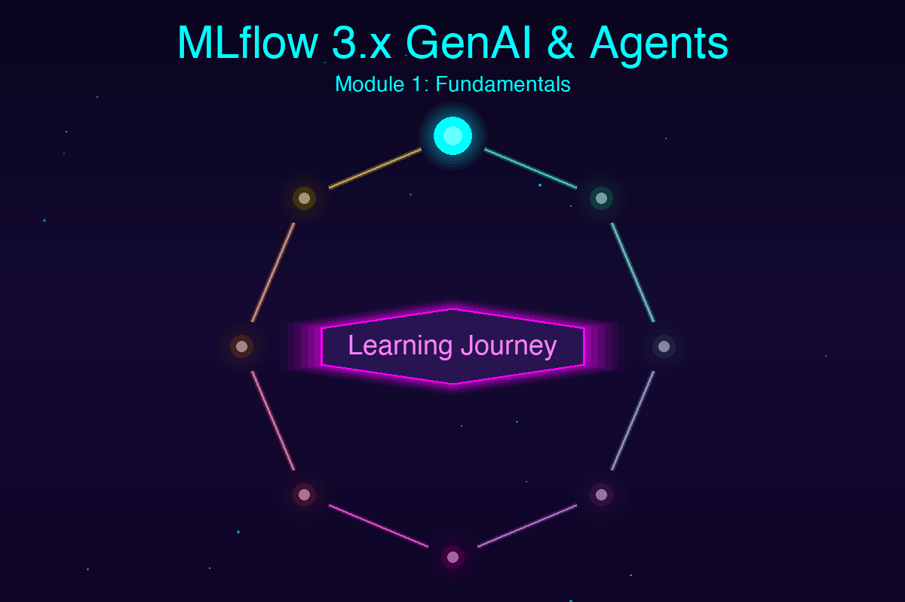

# MLflow 3.x GenAI & Agents Learning Plan

A comprehensive, modular learning plan for mastering MLflow 3.x with focus on GenAI applications and Agents. Each module builds upon previous knowledge.



---

## 📚 Module 1: MLflow 3.x Fundamentals & What's New

**Goal:** Understand MLflow 3.x architecture changes and new capabilities for GenAI

### Key Concepts
- **LoggedModel Entity**: New first-class citizen replacing run-centric approach
- **Model-Centric Architecture**: Better organization of GenAI agents, checkpoints, and model variants
- **Enhanced Lineage Tracking**: Comprehensive connections between models, runs, traces, prompts, and metrics
- **Migration from MLflow 2.x**: API changes and deprecated features

### Documentation Links
- [MLflow 3 Overview](https://mlflow.org/docs/latest/genai/mlflow-3/)
- [MLflow for GenAI](https://mlflow.org/docs/latest/genai/)
- [What's New in MLflow 3](https://mlflow.org/releases/3)

### Your Codebase Examples
- **Core utilities**: `utils/mlflow_setup.py` - Shows current MLflow tracking patterns
- **Basic tracking**: `tracking/simple_tracking_basic.py` - Entry point for MLflow fundamentals

### Hands-On Exercises
1. Review your existing `mlflow_setup.py` utility to understand current setup patterns
2. Run `uv run mlflow-tracking-example` to see basic MLflow tracking in action
3. Explore the MLflow UI with `mlflow ui` to understand experiment organization
4. Read the migration guide to understand differences from MLflow 2.x

### Success Criteria
- ✅ Understand LoggedModel entity vs run-centric approach
- ✅ Can explain model lineage tracking
- ✅ Successfully run basic MLflow tracking examples
- ✅ Comfortable navigating MLflow UI

---

## 📚 Module 2: MLflow Tracing for LLM Observability

**Goal:** Master MLflow's tracing capabilities for observing and debugging LLM applications

### Key Concepts
- **Automatic Tracing**: One-line autolog integration with 20+ GenAI frameworks
- **Manual Tracing**: Flexible decorators, context managers, and APIs for custom traces
- **Trace Anatomy**: Inputs, outputs, metadata, and intermediate steps
- **OpenTelemetry Compatibility**: 100% open-source standards
- **Production Monitoring**: Async logging and lightweight SDK

### Documentation Links
- [MLflow Tracing Overview](https://mlflow.org/docs/latest/genai/tracing/)
- [MLflow Tracing - Databricks Guide](https://docs.databricks.com/en/mlflow/mlflow-tracing.html)
- [Practical AI Observability Blog](https://mlflow.org/blog/ai-observability-mlflow-tracing)

### Your Codebase Examples
- **LangChain + Ollama**: `spark/spark_langchain_ollama.py` (lines 347-348)
  - Shows `mlflow.langchain.autolog(silent=True)` usage
  - Demonstrates automatic LLM trace capture
- **LangChain Multiple Modes**: `spark/spark_langchain_multiple_mode.py` (lines 328-330)
  - Conditional autolog based on LLM type
- **LlamaIndex RAG**: `spark/spark_llamaindex_rag.py` (lines 485-493)
  - Shows `mlflow.llama_index.autolog()` for RAG tracing

### Hands-On Exercises
1. **Basic Tracing** - Enable autolog for OpenAI or Ollama:
   ```bash
   # Install Ollama and pull a model first
   ollama pull llama3.2

   # Run the LangChain example with tracing
   uv run mlflow-spark-langchain-ollama --num-samples 20
   ```

2. **Explore Traces** - View traces in MLflow UI:
   ```bash
   mlflow ui
   # Navigate to the experiment and examine trace details
   ```

3. **Custom Tracing** - Modify `spark_langchain_ollama.py` to add custom trace spans

4. **Multi-Framework Comparison** - Run both LangChain and LlamaIndex examples to compare tracing

### Success Criteria
- ✅ Can enable autolog for LangChain and LlamaIndex
- ✅ Understand trace hierarchy and metadata structure
- ✅ Successfully view and analyze traces in MLflow UI
- ✅ Can add custom trace instrumentation

---

## 📚 Module 3: Prompt Engineering & Registry

**Goal:** Master prompt lifecycle management using MLflow's Prompt Registry

### Key Concepts
- **Prompt Versioning**: Git-style version control for prompts
- **Immutability**: Prompts are immutable for reproducibility
- **Template Management**: Support for variable substitution and formatting
- **A/B Testing**: Test different prompt versions in production
- **Rollback Capabilities**: Instant rollback to previous versions
- **Search API**: `search_prompts()` for prompt discovery

### Documentation Links
- [Prompt Registry](https://mlflow.org/docs/latest/genai/prompt-registry/)
- [Prompt Engineering UI](https://mlflow.org/docs/latest/genai/prompt-registry/prompt-engineering/)
- [Evaluate Prompt Versions - Databricks](https://docs.databricks.com/aws/en/mlflow3/genai/prompt-version-mgmt/prompt-registry/evaluate-prompts)
- [End-to-End Prompt Lifecycle Blog](https://medium.com/dscier/end-to-end-prompt-lifecycle-management-and-optimization-with-mlflow-f7cc5eb4c817)

### Code Examples from Docs
```python
# Register a prompt
system_prompt = mlflow.genai.register_prompt(
    name="chatbot_prompt",
    template="You are a chatbot that can answer questions about {{topic}}. Answer this question: {{question}}",
    commit_message="Initial version of chatbot"
)

# Use the prompt
from langchain_core.prompts import ChatPromptTemplate
prompt = ChatPromptTemplate.from_template(
    system_prompt.to_single_brace_format()
)
```

### Your Codebase Integration Points
Currently, your codebase uses inline prompts. Create new examples:
- **New file suggestion**: `genai/prompt_registry_example.py`
- **Integration point**: Modify `spark_langchain_ollama.py` to use registered prompts (lines 195-196)

### Hands-On Exercises
1. **Register Your First Prompt**:
   - Create a prompt template for sentiment analysis
   - Version it using `mlflow.genai.register_prompt()`
   - Test different versions

2. **Prompt Iteration**:
   - Register v1 of a Q&A prompt
   - Evaluate performance
   - Register improved v2 based on results
   - Compare versions

3. **Template Variables**:
   - Create prompts with multiple variables
   - Test different variable substitutions
   - Track which combinations work best

4. **Search & Discovery**:
   - Use `mlflow.search_prompts()` to find prompts
   - Filter by tags and metadata

### Success Criteria
- ✅ Can register and version prompts
- ✅ Understand prompt immutability benefits
- ✅ Can compare prompt versions
- ✅ Successfully integrate prompts with LangChain/LlamaIndex

---

## 📚 Module 4: Building GenAI Agents with MLflow

**Goal:** Build and track complete GenAI agents with full observability

### Key Concepts
- **Agent Architecture**: Chain/pipeline construction with LangChain
- **Tool Integration**: Function calling and external tool usage
- **Agent Tracing**: Capturing multi-step agent workflows
- **State Management**: Tracking agent state across interactions
- **ResponsesAgent**: Streaming responses for real-time applications

### Documentation Links
- [GenAI Agent with MLflow 3](https://mlflow.org/docs/latest/genai/mlflow-3/genai-agent/)
- [Agent Observability - Databricks](https://docs.databricks.com/aws/en/mlflow/mlflow-tracing)
- [Monitoring Agents Tutorial](https://www.dataleadsfuture.com/monitoring-qwen-3-agents-with-mlflow-3-x-end-to-end-tracking-tutorial/)

### Architecture Pattern from Docs
```python
from langchain_core.prompts import ChatPromptTemplate
from langchain_openai import ChatOpenAI
from langchain.schema.output_parser import StrOutputParser

# 1. Register prompt
prompt_version = mlflow.genai.register_prompt(
    name="agent_prompt",
    template="You are an agent. {{instructions}}"
)

# 2. Create chain
prompt = ChatPromptTemplate.from_template(
    prompt_version.to_single_brace_format()
)
chain = prompt | ChatOpenAI(temperature=0.7) | StrOutputParser()

# 3. Enable tracing
mlflow.langchain.autolog()

# 4. Set active model (MLflow 3 feature)
mlflow.genai.set_active_model(model_name="my-agent")

# 5. Generate traces
with mlflow.start_run():
    result = chain.invoke({"instructions": "Answer questions"})
```

### Your Codebase Examples
Your codebase has agent foundations but needs enhancement:
- **Current**: `spark_langchain_ollama.py` - Basic LLM integration
- **Current**: `spark_llamaindex_rag.py` - RAG system (basic agent)
- **Enhance**: Add agent-specific patterns with tools and multi-step reasoning

### Hands-On Exercises
1. **Simple Agent**:
   - Build a Q&A agent using your RAG example as base
   - Add prompt registry integration
   - Enable tracing with `mlflow.langchain.autolog()`

2. **Multi-Tool Agent**:
   - Create an agent with multiple tools (e.g., calculator, search, RAG)
   - Track tool usage in traces
   - Measure which tools are most useful

3. **Conversational Agent**:
   - Build agent with conversation memory
   - Track conversation state across turns
   - Analyze conversation quality

4. **Production Agent**:
   - Add streaming responses
   - Implement error handling
   - Add human feedback collection

### Success Criteria
- ✅ Can build multi-step agents with LangChain
- ✅ Understand agent tracing patterns
- ✅ Can integrate tools and track usage
- ✅ Successfully deploy agent with full observability

---

## 📚 Module 5: RAG (Retrieval-Augmented Generation) Systems

**Goal:** Master building and tracking RAG systems with MLflow

### Key Concepts
- **Vector Stores**: Embedding-based retrieval
- **Document Chunking**: Optimal chunk size and overlap strategies
- **Embedding Models**: Local (HuggingFace) vs Cloud (OpenAI)
- **Query Engines**: Top-k retrieval and response synthesis
- **RAG Metrics**: Source retrieval rate, answer quality, faithfulness

### Documentation Links
- [LlamaIndex Integration](https://mlflow.org/docs/latest/llms/llamaindex/)
- [Tracing LlamaIndex](https://mlflow.org/docs/latest/genai/tracing/)

### Your Codebase Examples
**Primary example**: `spark/spark_llamaindex_rag.py` - Complete RAG implementation

Key sections to study:
- **Document loading**: Lines 60-110 - Spark-based distributed document loading
- **Chunking strategy**: Lines 113-204 - UDF-based document chunking
- **RAG setup**: Lines 277-336 - LlamaIndex vector store and query engine
- **Evaluation**: Lines 405-426 - RAG metrics calculation

### Architecture Highlights from Your Code
```python
# 1. Load documents with Spark (distributed)
docs_df = load_documents_with_spark(spark, docs_path)

# 2. Chunk documents with Spark UDFs
chunks_df = chunk_documents_with_spark(
    spark, docs_df,
    chunk_size=512,
    chunk_overlap=50
)

# 3. Setup LlamaIndex with local embeddings
embed_model = HuggingFaceEmbedding(model_name="BAAI/bge-small-en-v1.5")
Settings.llm = llm
Settings.embed_model = embed_model

# 4. Create vector index and query engine
index = VectorStoreIndex.from_documents(documents)
query_engine = index.as_query_engine(similarity_top_k=3)

# 5. Enable autolog
mlflow.llama_index.autolog()
```

### Hands-On Exercises
1. **Basic RAG Setup**:
   ```bash
   # Create sample documents
   uv run mlflow-sample-documents

   # Run RAG example with mock LLM
   uv run mlflow-spark-llamaindex-rag --llm-type mock --create-sample-docs
   ```

2. **RAG with Ollama**:
   ```bash
   # With local Ollama
   uv run mlflow-spark-llamaindex-rag \
     --llm-type ollama \
     --ollama-model llama3.2 \
     --docs-path ./documents
   ```

3. **Optimize Chunking**:
   - Experiment with different chunk sizes (256, 512, 1024)
   - Try different overlap values (0, 50, 100)
   - Compare retrieval quality via `source_retrieval_rate` metric

4. **Custom Documents**:
   - Add your own documentation to `./documents/`
   - Run RAG system on your docs
   - Evaluate answer quality

5. **Advanced**: Spark + RAG at Scale
   - Use your existing Spark examples as base
   - Process large document collections with Spark
   - Track embeddings and queries with MLflow

### Success Criteria
- ✅ Understand RAG architecture and components
- ✅ Can configure chunking strategies effectively
- ✅ Successfully run RAG with multiple LLM backends
- ✅ Can evaluate and optimize RAG performance

---

## 📚 Module 6: LLM Evaluation & Quality Metrics

**Goal:** Systematically evaluate and improve GenAI application quality

### Key Concepts
- **Evaluation Datasets**: Creating ground truth for testing
- **Built-in Metrics**: Answer similarity, correctness, relevance, faithfulness
- **Custom Judges**: Domain-specific evaluation criteria
- **A/B Testing**: Comparing model/prompt versions
- **Production Monitoring**: Continuous quality assessment

### Documentation Links
- [Evaluating LLMs with MLflow](https://www.datacamp.com/tutorial/evaluating-llms-with-mlflow)
- [MLflow Evaluate API](https://mlflow.org/docs/latest/models.html#model-evaluation)
- [GenAI Evaluation Best Practices](https://mlflow.org/docs/latest/genai/)

### Evaluation Workflow
```python
# 1. Create evaluation dataset
eval_data = pd.DataFrame({
    "question": ["What is ML?", "Explain Python"],
    "ground_truth": ["Machine learning is...", "Python is..."]
})

# 2. Define evaluation function
def model_fn(inputs):
    return [agent.invoke(q) for q in inputs["question"]]

# 3. Run evaluation
results = mlflow.evaluate(
    model=model_fn,
    data=eval_data,
    model_type="question-answering",
    evaluators=["default"],
    extra_metrics=[
        mlflow.metrics.genai.answer_similarity(),
        mlflow.metrics.genai.answer_correctness(),
        mlflow.metrics.genai.faithfulness()
    ]
)

# 4. View results
print(results.metrics)
```

### Your Codebase Integration Points
Current metrics in your code:
- **RAG metrics**: `spark_llamaindex_rag.py:405-426` - Basic success rate and length
- **Sentiment metrics**: `spark_langchain_ollama.py:280-308` - Accuracy calculations

**Enhancement needed**: Add GenAI-specific evaluation metrics

### Hands-On Exercises
1. **Create Evaluation Dataset**:
   - Build dataset with questions and expected answers
   - Cover edge cases and failure modes
   - Version dataset in MLflow

2. **Evaluate RAG System**:
   - Use your RAG example as test subject
   - Measure answer similarity and correctness
   - Compare different chunk sizes

3. **Prompt Comparison**:
   - Create 3 different prompt versions
   - Evaluate each on same dataset
   - Pick best performer

4. **Custom Metrics**:
   - Create domain-specific evaluation metric
   - Integrate with MLflow evaluation
   - Track over time

5. **A/B Testing**:
   - Compare Ollama vs OpenAI on same tasks
   - Compare different model sizes
   - Analyze cost vs quality tradeoffs

### Success Criteria
- ✅ Can create quality evaluation datasets
- ✅ Understand built-in GenAI metrics
- ✅ Successfully run comparative evaluations
- ✅ Can build custom evaluation metrics

---

## 📚 Module 7: Production Deployment & Monitoring

**Goal:** Deploy GenAI agents to production with comprehensive monitoring

### Key Concepts
- **Model Registry**: Versioning and stage transitions
- **Deployment Patterns**: REST API, batch, streaming
- **Production Tracing**: Async logging for performance
- **Human Feedback**: Collecting and integrating user feedback
- **Cost Tracking**: Token usage and cost monitoring
- **Performance Optimization**: Latency and throughput

### Documentation Links
- [MLflow Model Registry](https://mlflow.org/docs/latest/model-registry.html)
- [Production AI Observability](https://mlflow.org/blog/ai-observability-mlflow-tracing)
- [Databricks MLflow Deployment](https://docs.databricks.com/aws/en/mlflow3/genai/)

### Production Checklist
- [ ] Model versioning in registry
- [ ] Staging → Production promotion workflow
- [ ] Automated evaluation in CI/CD
- [ ] Production trace logging
- [ ] Human feedback collection
- [ ] Cost and latency monitoring
- [ ] Error alerting and recovery
- [ ] Rollback procedures

### Your Codebase Enhancement Path
Current state: Development-focused examples

Production additions needed:
1. **Model Registry Integration**:
   - Register RAG system as model
   - Version prompt + retriever + LLM together
   - Stage transitions

2. **API Deployment**:
   - Create FastAPI wrapper for agents
   - Add authentication
   - Implement rate limiting

3. **Monitoring Dashboard**:
   - Track request volume
   - Monitor latency percentiles
   - Alert on quality degradation

### Hands-On Exercises
1. **Register Model**:
   ```python
   # After training/building agent
   mlflow.pyfunc.log_model(
       artifact_path="agent",
       python_model=agent_wrapper,
       registered_model_name="my-genai-agent"
   )
   ```

2. **Stage Promotion**:
   - Move model from None → Staging
   - Run evaluation tests
   - Promote Staging → Production

3. **Production Tracing**:
   - Enable async trace logging
   - Monitor trace volume
   - Set up trace sampling for high-traffic

4. **Feedback Loop**:
   - Add thumbs up/down to responses
   - Log feedback with traces
   - Use feedback to improve prompts

5. **Cost Monitoring**:
   - Track token usage per request
   - Calculate costs for different LLMs
   - Optimize for cost/quality balance

### Success Criteria
- ✅ Can register and version complete agents
- ✅ Understand deployment patterns
- ✅ Successfully set up production monitoring
- ✅ Have feedback collection mechanism

---

## 📚 Module 8: Advanced Patterns & Integration

**Goal:** Master advanced MLflow 3.x patterns for complex GenAI systems

### Key Concepts
- **Multi-Agent Systems**: Coordinating multiple specialized agents
- **Spark + GenAI**: Distributed LLM processing at scale
- **Hybrid Systems**: Combining traditional ML + GenAI
- **Fine-tuning Tracking**: Tracking LLM fine-tuning experiments
- **DSPy Integration**: Automatic prompt optimization
- **PydanticAI & Smolagents**: Emerging framework integrations

### Documentation Links
- [MLflow 3 GenAI Features](https://mlflow.org/docs/latest/genai/mlflow-3/)
- [Databricks MLflow 3 Blog](https://www.databricks.com/blog/mlflow-30-unified-ai-experimentation-observability-and-governance)

### Your Codebase Strengths
Your repo already demonstrates advanced patterns:

1. **Spark + GenAI Integration**:
   - `spark_langchain_ollama.py` - Distributed sentiment analysis
   - `spark_llamaindex_rag.py` - Distributed document processing

2. **Utility Abstractions**:
   - `utils/loader.py` - Dynamic module loading
   - `utils/mlflow_setup.py` - Centralized MLflow config
   - `utils/spark_utils.py` - Spark session management

3. **Multi-Backend Support**:
   - Mock, Ollama, OpenAI flexibility
   - Framework-agnostic patterns

### Advanced Exercises
1. **Multi-Agent Orchestration**:
   - Create coordinator agent
   - Add specialized sub-agents (RAG, calculation, search)
   - Track full multi-agent traces

2. **Spark-Scale GenAI**:
   - Process 10,000+ documents with Spark + RAG
   - Use Spark UDFs for batch LLM inference
   - Optimize for cost with batching

3. **Hybrid ML + GenAI**:
   - Combine sklearn classifier with LLM
   - Use LLM for feature engineering
   - Track both traditional metrics and GenAI metrics

4. **Prompt Optimization Pipeline**:
   - Integrate DSPy for automatic prompt improvement
   - Use evaluation data to guide optimization
   - Version optimized prompts in registry

5. **Cost Optimization**:
   - Implement semantic caching
   - Use smaller models for simple queries
   - Route queries to appropriate model sizes

### Your Next Steps
Based on your codebase, recommended enhancements:

1. **Extend `genai/` directory**:
   - Add agent examples
   - Add evaluation utilities
   - Add deployment templates

2. **Create `genai/agents/` subdirectory**:
   - `simple_agent.py` - Basic agent with tools
   - `rag_agent.py` - Enhanced RAG with memory
   - `multi_agent.py` - Coordinated multi-agent system

3. **Add to `utils/`**:
   - `genai_setup.py` - GenAI-specific MLflow config
   - `evaluation.py` - Evaluation metric utilities
   - `prompt_utils.py` - Prompt registry helpers

### Success Criteria
- ✅ Can build multi-agent systems
- ✅ Understand Spark + GenAI integration patterns
- ✅ Successfully optimize prompts programmatically
- ✅ Can design cost-effective GenAI systems

---

## 🎯 Learning Path Recommendations

### Beginner Track (New to MLflow)
1. Module 1 (Fundamentals) → Module 2 (Tracing) → Module 5 (RAG) → Module 3 (Prompts)

### Intermediate Track (Know MLflow, New to GenAI)
1. Module 1 (What's New) → Module 2 (Tracing) → Module 3 (Prompts) → Module 4 (Agents) → Module 6 (Evaluation)

### Advanced Track (Production GenAI Focus)
1. Module 1 → Module 2 → Module 4 → Module 6 → Module 7 → Module 8

### Your Recommended Path (Based on Codebase)
You already have strong Spark + MLflow foundations. Focus on:
1. **Module 2** (Tracing) - Add to existing examples
2. **Module 3** (Prompts) - Replace inline prompts with registry
3. **Module 4** (Agents) - Extend RAG to full agents
4. **Module 6** (Evaluation) - Add systematic evaluation
5. **Module 7** (Production) - Deploy your RAG system

---

## 🛠️ Quick Reference Commands

### Installation & Setup
```bash
# Install dependencies
uv sync --extra langchain --extra llamaindex

# Install dev tools
uv sync --extra dev
```

### Running Examples
```bash
# Basic tracking
uv run mlflow-tracking-example

# LangChain + Ollama (requires ollama running)
ollama pull llama3.2
uv run mlflow-spark-langchain-ollama --num-samples 50

# RAG system
uv run mlflow-sample-documents  # Create sample docs
uv run mlflow-spark-llamaindex-rag --llm-type mock --create-sample-docs
```

### MLflow UI
```bash
# View experiments and traces
mlflow ui

# Custom port
mlflow ui --port 5001
```

### Testing & Quality
```bash
# Run tests
pytest

# Check types
mypy .

# Format code
black . && isort .
```

---

## 📖 Additional Resources

### Official MLflow Resources
- [MLflow Documentation](https://mlflow.org/docs/latest/)
- [MLflow GitHub](https://github.com/mlflow/mlflow)
- [MLflow Community](https://mlflow.org/community)

### Learning Materials
- [DataCamp: Evaluating LLMs with MLflow](https://www.datacamp.com/tutorial/evaluating-llms-with-mlflow)
- [Databricks Blog: MLflow 3.0](https://www.databricks.com/blog/mlflow-30-unified-ai-experimentation-observability-and-governance)
- [Medium: End-to-End Prompt Lifecycle](https://medium.com/dscier/end-to-end-prompt-lifecycle-management-and-optimization-with-mlflow-f7cc5eb4c817)

### Framework Documentation
- [LangChain](https://python.langchain.com/)
- [LlamaIndex](https://docs.llamaindex.ai/)
- [Apache Spark](https://spark.apache.org/docs/latest/)

---

## ✅ Progress Tracker

Track your progress through the modules:

- [ ] Module 1: MLflow 3.x Fundamentals
- [ ] Module 2: MLflow Tracing
- [ ] Module 3: Prompt Engineering & Registry
- [ ] Module 4: Building GenAI Agents
- [ ] Module 5: RAG Systems
- [ ] Module 6: Evaluation & Metrics
- [ ] Module 7: Production Deployment
- [ ] Module 8: Advanced Patterns

### Learning Goals
- [ ] Run all existing codebase examples
- [ ] Add tracing to all GenAI examples
- [ ] Migrate inline prompts to prompt registry
- [ ] Build first complete agent with tools
- [ ] Set up evaluation pipeline
- [ ] Deploy one agent to production

---

**Last Updated**: October 2025
**MLflow Version**: 3.3.2
**Target Audience**: Developers transitioning to MLflow 3.x for GenAI applications
