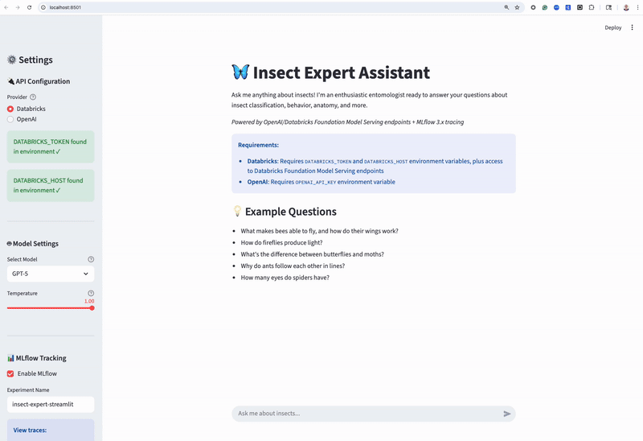

# 🦋 GenAI Agents - MLflow Tracing and Evaluation

An MLflow-based modular framework for building AI agents with **MLflow 3.x tracing**, **LLM-as-a-Judge evaluation**, and **DeepEval integration**. Features multiple reference implementations including conversation agents and specialized experts.



## 🏗️ Architecture Overview

### Module Structure

```
genai/
├── common/                    # Shared utilities and configurations
│   ├── config.py             # AgentConfig, EvaluationConfig dataclasses
│   ├── providers.py          # Multi-provider client factory (OpenAI/Databricks)
│   └── mlflow_config.py      # MLflow tracking setup and run management
│
└── agents/
    ├── insect_expert/         # Insect Expert Agent implementation
    │   ├── agent.py           # Main agent class with MLflow tracing
    │   ├── evaluation.py      # LLM-as-a-Judge evaluator
    │   ├── prompts.py         # System and evaluation prompts
    │   ├── insect_agent_streamlit_app.py  # Interactive web UI
    │   └── tests/
    │       └── test_simplified_evaluation.py
    │
    ├── multi_turn/            # Multi-turn conversation evaluation
    │   ├── customer_support_agent_simple.py      # Conversation-only agent
    │   ├── customer_support_agent_v2.ipynb       # Tutorial notebook (MLflow judges)
    │   ├── scenarios.py       # Pre-built conversation scenarios
    │   ├── prompts.py         # System and judge prompts
    │   └── README.md          # Multi-turn conversation guide
    │
    ├── deepeval/              # DeepEval integration (MLflow 3.8+)
    │   ├── customer_support_simple_deepeval_agent.py  # CLI with DeepEval scorers
    │   ├── customer_support_deepeval_demo.ipynb       # Tutorial notebook (DeepEval)
    │   └── README.md          # DeepEval integration guide
    │
    └── agent_planning/        # Multi-step agent planning evaluation
        └── ...                # Agent planning examples
```

### Key Abstractions

**1. Configuration Layer** (`genai/common/config.py`)
- `AgentConfig` - Agent model, temperature, provider settings
- `EvaluationConfig` - Judge model and evaluation settings

**2. Provider Layer** (`genai/common/providers.py`)
- `get_client()` - Unified client factory supporting OpenAI and Databricks
- Handles authentication and endpoint configuration

**3. Agent Layer** (`genai/agents/insect_expert/agent.py`)
- `InsectExpertAgent` - Self-contained agent with MLflow tracing
- Uses `@mlflow.trace()` decorators for observability
- Optional LLM-as-a-Judge evaluation

**4. Evaluation Layer** (`genai/agents/insect_expert/evaluation.py`)
- `InsectExpertEvaluator` - Custom judge using `mlflow.genai.judges.make_judge()`
- Provides categorical ratings (excellent/good/fair/poor) with rationale

---

## 🚀 Quick Start - Insect Expert Agent

### 1. Set Environment Variables

**For Databricks Foundation Model Serving (Default):**
```bash
export DATABRICKS_TOKEN='your-databricks-token'
export DATABRICKS_HOST='https://your-workspace.cloud.databricks.com'
```

**For OpenAI:**
```bash
export OPENAI_API_KEY='your-openai-api-key'
```

### 2. Install Dependencies

```bash
uv sync
```

### 3. Run the Agent

**Interactive Streamlit UI:**
# Start MLflow UI
```bash
mlflow server --backend-store-uri sqlite:///mlflow.db --port 5000

# Using uv run
uv run streamlit run genai/agents/insect_expert/insect_agent_streamlit_app.py

# With debug mode (shows evaluation details)
uv run streamlit run genai/agents/insect_expert/insect_agent_streamlit_app.py -- --debug
```

**Test Programmatic or CLI Usage:**
```bash
# Run test with evaluation
export DATABRICKS_TOKEN='your-token'
export DATABRICKS_HOST='your-host'

# Start MLflow UI
mlflow server --backend-store-uri sqlite:///mlflow.db --port 5000
# run the simple test to verify evaluation

uv run python genai/agents/insect_expert/tests/test_simplified_evaluation.py
```

### 4. View MLflow Traces

Open http://localhost:5000 → Traces tab

---

## 💻 Programmatic Usage

### Basic Example

```python
from genai.common.config import AgentConfig, EvaluationConfig
from genai.common.mlflow_config import setup_mlflow_tracking
from genai.agents.insect_expert import InsectExpertAgent
import mlflow

# Setup MLflow tracking
setup_mlflow_tracking("insect-expert-demo")

# Configure agent
config = AgentConfig(
    model="databricks-gemini-2-5-flash",
    temperature=1.0,
    provider="databricks",
    enable_evaluation=True,
    debug=False
)

# Configure evaluation (optional)
eval_config = EvaluationConfig(
    enabled=True,
    judge_model="databricks-gemini-2-5-flash"
)

# Initialize agent
agent = InsectExpertAgent(config=config, evaluation_config=eval_config)

# Ask a question with MLflow tracing
with mlflow.start_run():
    question = "What makes bees able to fly?"
    answer = agent.answer_question(question)
    print(answer)

    # Evaluate the response
    eval_scores = agent.evaluate_last_response(question=question, answer=answer)
    print(f"Rating: {eval_scores.get('rating')}")
    print(f"Rationale: {eval_scores.get('rationale')}")
```

### Switching Providers

```python
# Use OpenAI instead
config = AgentConfig(
    model="gpt-4-turbo",
    temperature=0.7,
    provider="openai",
    enable_evaluation=True
)

agent = InsectExpertAgent(config=config)
```

---

## 🤖 Available Models

### Databricks Foundation Model Serving
- `databricks-gpt-5` - Latest OpenAI model
- `databricks-gemini-2-5-flash` - Google's fast model
- `databricks-claude-sonnet-4-5` - Anthropic's Claude

### OpenAI Models
- `gpt-4`
- `gpt-4-turbo`
- `gpt-3.5-turbo`

---

## 🔧 Features

### Core Capabilities
- **Multi-Provider Support** - Seamlessly switch between Databricks and OpenAI
- **MLflow Tracing** - Full observability with `@mlflow.trace` decorators
- **LLM-as-a-Judge Evaluation** - Automatic quality assessment with custom judges
- **Modular Design** - Reusable components for building new agents
- **Configuration-Based** - Clean separation of config and implementation

### MLflow Integration
- **Automatic Tracing** - AGENT → LLM span hierarchy
- **Custom Judges** - Categorical ratings with detailed rationale
- **Metrics Logging** - Evaluation scores logged to MLflow
- **Trace Inspection** - View complete request/response chains in MLflow UI

### Evaluation Features
- **Real-time Quality Ratings** - Excellent, Good, Fair, Poor
- **Structured Feedback** - Analysis of relevance, accuracy, clarity, length
- **Judge Model Selection** - Choose your evaluation model
- **MLflow Metrics** - Track quality over time

---

## 🔍 Troubleshooting

**Agent initialization fails:**
```bash
# Check environment variables
echo $DATABRICKS_TOKEN
echo $DATABRICKS_HOST

# Verify Databricks access
curl -H "Authorization: Bearer $DATABRICKS_TOKEN" \
  "$DATABRICKS_HOST/api/2.0/serving-endpoints"
```

**Missing MLflow traces:**
- Ensure `mlflow.openai.autolog()` is enabled (default)
- Check that MLflow tracking URI is set correctly
- Verify traces in MLflow UI: http://localhost:5000

**Evaluation not working:**
- Set `enable_evaluation=True` in AgentConfig
- Provide EvaluationConfig with valid judge model
- Check judge model has access to same provider

---

## 📖 Documentation

### Agent-Specific Guides
- **[Multi-Turn Conversations](./multi_turn/README.md)** - Session-level tracking and evaluation with MLflow judges
- **[DeepEval Integration](./deepeval/README.md)** - Industry-standard conversational AI metrics (MLflow 3.8+)

### MLflow Resources
- [MLflow Tracing Guide](https://mlflow.org/docs/latest/llms/tracing/index.html)
- [LLM-as-a-Judge](https://mlflow.org/docs/latest/genai/eval-monitor/scorers/llm-judge/predefined/)
- [MLflow DeepEval Integration](https://mlflow.org/docs/latest/genai/eval-monitor/scorers/deepeval-scorers/)
- [Session Tracking](https://mlflow.org/docs/latest/genai/tracing/track-users-sessions/)

### Databricks Resources
- [Personal Access Token Guide](https://docs.databricks.com/en/dev-tools/auth/pat.html)
- [Foundation Model APIs](https://docs.databricks.com/en/machine-learning/foundation-models/index.html)

### DeepEval Resources
- [DeepEval Documentation](https://docs.confident-ai.com/)
- [Conversational Metrics](https://docs.confident-ai.com/docs/metrics-conversational)

---

## 🎯 Next Steps

1. **Explore the Streamlit UI** - Interactive agent with live evaluation
2. **Try Multi-Turn Conversations** - Session-level evaluation with MLflow judges
3. **Use DeepEval Metrics** - Industry-standard conversation quality metrics
4. **Review MLflow Traces** - Understand agent behavior and performance
5. **Experiment with Models** - Try different LLMs and evaluation judges
6. **Build New Agents** - Use existing agents as templates for custom implementations

---

Made with ❤️ using **MLflow 3.8+** + **DeepEval** + **Databricks/OpenAI** + **Streamlit**
