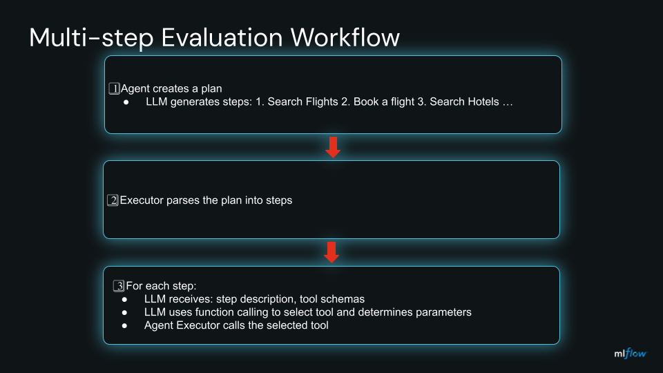

# LLM-as-a-judge for Multi-step Agent Planning Evaluation Tutorial

This tutorial demonstrates multi-agent planning with tool execution and MLflow-based evaluation.

## Overview

This module showcases a complete workflow for AI agent planning:

1. **Plan Generation**: LLM creates a multi-step plan for a given task
2. **Plan Execution**: Agent executes the plan by calling actual tools
3. **Plan Evaluation**: MLflow judge evaluates both the plan quality and execution results

## Architecture: How LLM Calls Tools

The LLM calls the tools via function calling. The executor orchestrates this process:



### Key Implementation Details

The execution flow is implemented in [agent_planning_executor.py](agent_planning_executor.py):

```python
# Step execution with LLM function calling
def _execute_step(self, step_number: int, step_description: str, task_goal: str):
    # Get tool schemas for LLM function calling
    tool_schemas = get_tool_schemas()

    # Create prompt for LLM
    prompt = get_execution_prompt(
        step_description=step_description,
        task_goal=task_goal,
        available_tools=list(tool_schemas.keys()),
        context=self.execution_context
    )

    # Call LLM with function calling capability
    response = self.client.chat.completions.create(
        model=self.config.model,
        messages=[{"role": "user", "content": prompt}],
        tools=[{"type": "function", "function": schema} for schema in tool_schemas.values()],
        tool_choice="auto"  # LLM decides which tool to use
    )

    # Extract LLM's tool selection
    tool_call = response.choices[0].message.tool_calls[0]
    tool_name = tool_call.function.name
    tool_params = json.loads(tool_call.function.arguments)

    # Execute the tool selected by the LLM
    tool = get_tool(tool_name)
    result = tool.execute(**tool_params)
```

**Important**: The agent doesn't hardcode which tools to call. The LLM dynamically selects:
- **Which tool** to use for each step (e.g., `flight_search_api` vs `hotel_search_api`)
- **What parameters** to pass (e.g., `{"origin": "NYC", "destination": "SFO"}`)
- **Whether** a tool is needed at all (some steps may be informational)

## Available Tools

The tutorial provides 5 simulated APIs that agents can call:

| Tool | Description | Example Parameters |
|------|-------------|-------------------|
| `flight_search_api` | Search for flights | `origin`, `destination`, `date` |
| `booking_api` | Book flights | `flight_id`, `passenger_name` |
| `hotel_search_api` | Search for hotels | `location`, `check_in`, `check_out` |
| `calendar_api` | Manage calendar events | `action`, `title`, `start_time`, `end_time` |
| `email_api` | Send emails | `recipient`, `subject`, `body` |

All tools:
- Inherit from `BaseTool` base class
- Return standardized `ToolResult` objects
- Are automatically traced with MLflow (`@mlflow.trace(span_type=SpanType.TOOL)`)
- Simulate realistic latency and data

See [tools/](tools/) directory for implementation details.

## Components

### 1. AgentPlanningJudge

Main class for plan generation and evaluation.

**Features**:
- Generates multi-step plans using LLM
- Creates MLflow judges for evaluation
- Evaluates plan quality on 5-point scale
- Integrates with MLflow experiments

**Usage**:
```python
from genai.common.config import AgentConfig
from genai.agents.agent_planning import AgentPlanningJudge

config = AgentConfig(
    provider="databricks",
    model="databricks-gpt-5"
)

judge = AgentPlanningJudge(config)
results = judge.run_complete_workflow(
    task_goal="Book a flight from NYC to San Francisco for next week"
)
```

### 2. AgentPlanningExecutor

Executes plans by calling actual tools.

**Features**:
- Parses multi-step plans
- Uses LLM function calling for tool selection
- Manages execution context between steps
- Traces all tool calls with MLflow

**Usage**:
```python
from genai.agents.agent_planning import AgentPlanningExecutor

executor = AgentPlanningExecutor(config)
execution_results = executor.execute_plan(
    plan="1. Search for flights from NYC to SFO\n2. Book the cheapest flight",
    task_goal="Book a flight from NYC to San Francisco"
)

print(f"Executed {execution_results['successful_steps']}/{execution_results['total_steps']} steps")
```

### 3. Tool System

Modular tool architecture with:
- **Base class**: `BaseTool` - Abstract class all tools inherit from
- **Tool registry**: Centralized tool management
- **Schema generation**: Automatic JSON schema creation for LLM function calling
- **Result standardization**: `ToolResult` dataclass for consistent outputs

## Complete Workflow Example

```python
from genai.common.config import AgentConfig
from genai.agents.agent_planning import AgentPlanningJudge

# 1. Configure agent
config = AgentConfig(
    provider="databricks",
    model="databricks-gpt-5"
)

# 2. Create judge
judge = AgentPlanningJudge(config)

# 3. Define task
task = "Plan a business trip: book flight from NYC to SF, reserve hotel, and schedule meetings"

# 4. Run complete workflow (Plan → Execute → Evaluate)
results = judge.run_complete_workflow(task_goal=task)

# 5. View results
print(f"Plan Quality: {results['evaluation']['quality']} ({results['evaluation']['score']}/5)")
print(f"Execution: {results['execution']['successful_steps']}/{results['execution']['total_steps']} steps successful")
```

## MLflow Integration

All agent actions are traced with MLflow:

```python
@mlflow.trace(span_type=SpanType.AGENT, name="execute_plan")
def execute_plan(self, plan: str, task_goal: str):
    # Execution logic with automatic tracing
    ...

@mlflow.trace(span_type=SpanType.TOOL, name="tool_call")
def execute(self, **params):
    # Tool execution with automatic tracing
    ...
```

### Evaluation with MLflow Judges

The tutorial uses `mlflow.genai.judges.make_judge()` for structured evaluation:

```python
judge = mlflow.genai.judges.make_judge(
    name="agent_planning_quality_judge",
    judge_kind="llm",
    instructions=get_judge_instructions(),
    result_type="DICT",
    scale=QUALITY_SCALE  # 5-point scale: excellent → very_poor
)

evaluation = judge.evaluate(
    input=task_goal,
    output=plan,
    resources=available_resources
)
```

## Running the Tutorial

### Option A: Python CLI Script

```bash
# Run with default settings (Databricks)
uv run mlflow-agent-planning-judge

# Run with OpenAI
uv run mlflow-agent-planning-judge --provider openai --model gpt-4

# Specify MLflow backend
uv run mlflow-agent-planning-judge --backend sqlite --db-path ./mlflow.db

# View results in MLflow UI
mlflow ui
```

**CLI Output Example:**
```
======================================================================
TUTORIAL: Multi-Agent Planning with MLflow
======================================================================

[Step 1] Setting up MLflow tracking
  └─ Experiment: agent-planning-judge
  └─ View traces: mlflow ui

[Step 2] Initializing Judge
  └─ Provider: databricks
  └─ Model: databricks-gpt-5

[Step 3] Defining Task
  └─ Task: Book a flight from NYC to San Francisco for next week

[Step 4] Agent creates a multi-step plan...
  └─ ✓ Plan created:
      1. Search for flights from NYC to San Francisco
      2. Select a suitable flight
      3. Book the selected flight
      4. Send confirmation email

[Step 5] Judge evaluates the plan quality...
  └─ Quality: GOOD (Score: 4/5)
  └─ Reasoning: Plan covers all necessary steps...

[Step 6] Executing plan with actual tools...
  └─ Executing 4 steps...
  └─ Step 1/4: Search for flights from NYC to San Francisco
     ✓ Used flight_search_api
  └─ Step 2/4: Select a suitable flight
  └─ Step 3/4: Book the selected flight
     ✓ Used booking_api
  └─ Step 4/4: Send confirmation email
     ✓ Used email_api

  ✓ Execution Complete!
  └─ Total Steps: 4
  └─ Successful: 3/4

======================================================================
```

### Option B: Interactive Jupyter Notebook

The notebook provides step-by-step execution with detailed explanations:

**1. Setup and Configuration**
```python
# Cell 1-6: Environment setup
# - Load .env file for credentials
# - Configure provider (Databricks/OpenAI)
# - Set models for agent and judge
```

**2. Initialize MLflow and Judge**
```python
# Cell 8: Setup MLflow tracing
[Step 1] MLflow tracing enabled
  └─ Experiment: agent-planning-notebook
  └─ View traces: mlflow ui

# Cell 10: Import AgentPlanningJudge
✓ AgentPlanningJudge imported successfully

# Cell 12: Initialize judge
[Step 2] Initializing Agent and Judge
  └─ Provider: databricks
  └─ Agent Model: databricks-gpt-5
  └─ Judge Model: databricks-gemini-2-5-flash
```

**3. Plan Creation and Evaluation**
```python
# Cell 14: Define task scenario
[Step 3] Define Planning Scenario
  └─ Task: Book a flight from NYC to San Francisco
  └─ Resources: flight_search_api, booking_api, email_api

# Cell 18: Agent creates plan
[Step 4] Agent creates a multi-step plan...
  └─ ✓ Plan created:
      1. Search for flights from NYC to SFO
      2. Book the cheapest flight
      3. Send confirmation email

# Cell 20: Judge evaluates plan
[Step 5] Judge evaluates the plan quality...
[Step 6] Evaluation Results
======================================================================
Quality: GOOD (Score: 4/5)

Detailed Assessment:
The plan is well-structured and covers the essential steps...
======================================================================
```

**4. Plan Execution with Tools**
```python
# Cell 22: Execute plan with actual tool calls
[Step 7] Executing plan with actual tools...
======================================================================

  ✓ Execution Complete!
  └─ Total Steps: 3
  └─ Successful: 3/3

  Step-by-Step Results:
  ✓ Step 1: flight_search_api
     Result: {'flights': [{'id': 'FL123', 'price': 250}...
  ✓ Step 2: booking_api
     Result: {'booking_id': 'BK789', 'status': 'confirmed'}...
  ✓ Step 3: email_api
     Result: {'status': 'sent', 'message_id': 'msg-456'}...
======================================================================
```

**5. Complete Workflow Function**
```python
# Cell 24: Run complete workflow
def run_complete_workflow(task: str, resources: List[str]):
    """
    Complete workflow: Plan → Evaluate → Execute
    """
    # Creates plan, evaluates quality, executes with tools
    # All in one function call

# Try different scenarios:
result = run_complete_workflow(
    task="Book flight and hotel for business trip",
    resources=["flight_search_api", "hotel_search_api", "booking_api"]
)
```

**Notebook Advantages:**
- ✅ Step-by-step execution with immediate feedback
- ✅ Easy to experiment with different tasks and resources
- ✅ View intermediate results (plan text, evaluation scores)
- ✅ Modify and re-run individual steps
- ✅ Educational comments and explanations

## Key Concepts Demonstrated

1. **Multi-Agent Planning**: Breaking complex tasks into executable steps
2. **LLM Function Calling**: Dynamic tool selection based on task requirements
3. **Context Management**: Passing results between execution steps
4. **MLflow Tracing**: Comprehensive observability for agent actions
5. **Evaluation as Code**: Reproducible quality assessment with MLflow judges
6. **Tool Abstraction**: Clean separation between tool interface and implementation

## File Structure

```
genai/agents/agent_planning/
├── __init__.py                      # Package exports
├── agent_planning_judge.py          # Main judge class
├── agent_planning_executor.py       # Plan execution engine
├── prompts.py                       # Prompt templates
├── README.md                        # This file
└── tools/                           # Tool implementations
    ├── __init__.py                  # Tool registry
    ├── base.py                      # BaseTool abstract class
    ├── utils.py                     # Fake data generation
    ├── flight_tools.py              # Flight search & booking
    ├── hotel_tools.py               # Hotel search
    ├── calendar_tools.py            # Calendar management
    └── email_tools.py               # Email sending
```

## Tutorial Formats Comparison

### Quick Visual Comparison

```
┌─────────────────────────────────────────────────────────────────────┐
│  📓 Jupyter Notebook          🐍 Python Script                      │
│  (agent_planning_judge.ipynb) (agent_planning_judge.py)             │
├─────────────────────────────────────────────────────────────────────┤
│                                                                     │
│  1. Load .env file ✓          1. Export env vars                    │
│  2. Configure provider         2. Run: uv run mlflow-...            │
│  3. Initialize judge           3. Single execution →                │
│  4. Create plan                4. View result                       │
│  5. Evaluate plan                                                   │
│  6. Execute with tools ✓                                            │
│  7. Try complete workflow ✓                                         │
│  8. View prompts/schemas ✓                                          │
│                                                                     │
│  ✅ Interactive learning       ✅ Automation ready                  │
│  ✅ Step-by-step execution     ✅ CI/CD integration                 │
│  ✅ Easy experimentation       ✅ Scriptable                        │
└─────────────────────────────────────────────────────────────────────┘
```

### Detailed Comparison

| Feature | Jupyter Notebook | Python Script |
|---------|------------------|---------------|
| **Best For** | Learning & experimentation | Production & automation |
| **Interactivity** | ✅ Run cells individually | ❌ Single execution |
| **Credentials** | `.env` file (auto-loaded) | Environment variables |
| **Workflow** | Plan → Evaluate → Execute | Complete workflow |
| **Explanations** | Rich markdown with inline docs | Code comments |
| **Tool Execution** | ✅ Step-by-step with output | ✅ Automated execution |
| **Customization** | ✅ Easy to modify and re-run | Requires code edits |

**Recommendation**: Start with the Jupyter notebook to understand the concepts, then use the Python script for automation.

## Next Steps

After completing this tutorial:
1. **Explore MLflow UI**: Run `mlflow ui` to see detailed traces
2. **Modify Prompts**: Edit `prompts.py` to change planning and evaluation criteria
3. **Try Different Models**: Experiment with different LLM models for planning vs execution
4. **Add Custom Tools**: Extend `BaseTool` to create your own tools
5. **Implement Retry Logic**: Add error recovery for failed tool executions
6. **Add Tool Caching**: Cache tool results to avoid redundant calls
7. **Apply to Your Use Case**: Adapt this pattern for your own multi-step agent tasks

## References

- MLflow Tracing: https://mlflow.org/docs/latest/llms/tracing/index.html
- MLflow Judges: https://mlflow.org/docs/latest/llms/llm-evaluate/index.html
- OpenAI Function Calling: https://platform.openai.com/docs/guides/function-calling
