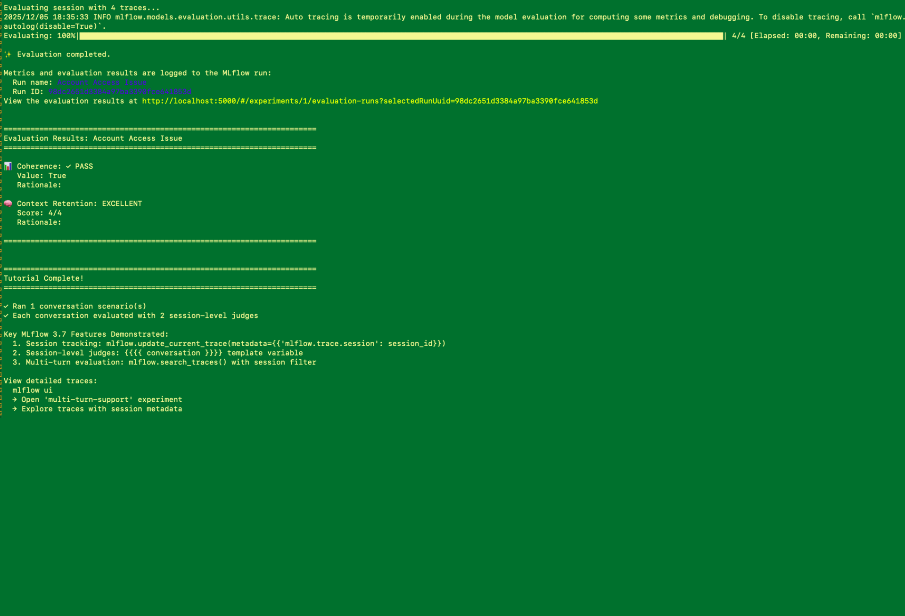

# Multi-Turn Conversation Evaluation with MLflow 3.7

Tutorial demonstrating MLflow 3.7's session-level evaluation features for multi-turn conversations.



## Overview

This tutorial showcases:
1. **Session Tracking**: Using `mlflow.update_current_trace()` to group conversation turns
2. **Session-Level Judges**: The `{{ conversation }}` template variable
3. **Multi-Turn Evaluation**: Evaluating entire conversations, not just individual turns

## MLflow 3.7 Key Features

### The {{ conversation }} Template Variable

When you use `{{ conversation }}` in a judge's instructions:
- MLflow automatically makes the judge **session-level**
- The judge receives the complete conversation, not just one turn
- All traces with the same `mlflow.trace.session` are aggregated

**Example:**
```python
judge = make_judge(
    name="coherence",
    model="openai:/gpt-4o-mini",
    instructions="Evaluate conversation coherence: {{ conversation }}. Return True if coherent.",
    feedback_value_type=bool
)

print(f"Is session-level: {judge.is_session_level_scorer}")  # True
```

### Session Tracking with update_current_trace()

```python
@mlflow.trace(span_type="CHAT_MODEL")
def handle_message(message, session_id):
    # CRITICAL: This links the trace to the session
    mlflow.update_current_trace(metadata={"mlflow.trace.session": session_id})

    response = generate_response(message)
    return response
```

### Evaluating Sessions

```python
# Search for all traces in a session
session_traces = mlflow.search_traces(
    experiment_ids=["<experiment-id>"],
    filter_string="metadata.`mlflow.trace.session` = 'session-123'"
)

# Evaluate the entire session
feedback = coherence_judge(session=session_traces)
```

## Architecture

```
┌─────────────────────────────────────────────────────────────────┐
│ User sends message                                              │
│   Turn 1: "My printer won't turn on"                            │
└────────────────────┬────────────────────────────────────────────┘
                     ↓
┌─────────────────────────────────────────────────────────────────┐
│ Agent handles message (@mlflow.trace + session metadata)        │
│   mlflow.update_current_trace(metadata={"session": "s-001"})    │
└────────────────────┬────────────────────────────────────────────┘
                     ↓
┌─────────────────────────────────────────────────────────────────┐
│ Agent responds                                                  │
│   Turn 1 Response: "Let's troubleshoot. Is it plugged in?"      │
└────────────────────┬────────────────────────────────────────────┘
                     ↓
┌─────────────────────────────────────────────────────────────────┐
│ User sends message                                              │
│   Turn 2: "Yes, it's plugged in securely"                       │
└────────────────────┬────────────────────────────────────────────┘
                     ↓
      [Repeat for turns 3, 4...]
                     ↓
┌─────────────────────────────────────────────────────────────────┐
│ Session-Level Evaluation                                        │
│   1. mlflow.search_traces(session="s-001") → All 4 traces       │
│   2. Judge uses {{ conversation }} template                     │
│   3. Evaluates complete conversation for coherence/context      │
└─────────────────────────────────────────────────────────────────┘
```

## Components

### CustomerSupportAgent

Main class implementing multi-turn conversations with session tracking.

**Key Methods:**
- `handle_message()`: Process one message, tag with session ID
- `run_conversation()`: Execute complete multi-turn conversation
- `evaluate_session()`: Apply session-level judges

### Session-Level Judges

**1. Coherence Judge** (Boolean)
- Evaluates logical flow across turns
- Returns True/False for conversation coherence

**2. Context Retention Judge** (Categorical)
- Assesses how well agent remembers prior context
- Returns: excellent, good, fair, or poor

Both use `{{ conversation }}` template → automatically session-level.

### Conversation Scenarios

**Scenario 1: Printer Troubleshooting**
- 4-turn conversation
- Progressive troubleshooting
- Expected: Excellent context retention, coherent

**Scenario 2: Account Access**
- 4-turn conversation
- Password reset workflow
- Expected: Good context retention, coherent

## Running the Tutorial

### Option A: Python CLI Script

```bash
# Run with Databricks
export DATABRICKS_TOKEN='your-token'
export DATABRICKS_HOST='https://your-workspace.cloud.databricks.com'
uv run mlflow-multi-turn-support

# Run with OpenAI
export OPENAI_API_KEY='sk-...'
uv run mlflow-multi-turn-support --provider openai

# Run specific scenario
uv run mlflow-multi-turn-support --scenario printer

# Use different models
uv run mlflow-multi-turn-support --model databricks-gpt-5 --judge-model databricks-gemini-2-5-flash

# Enable debug output to see DataFrame columns and evaluation details
uv run mlflow-multi-turn-support --debug

# View results
mlflow ui
```

**Expected Output:**

```
======================================================================
TUTORIAL: MLflow 3.7 Multi-Turn Conversation Evaluation
======================================================================

[Step 1] MLflow tracing enabled
  └─ Experiment: multi-turn-support
  └─ View traces: mlflow ui

[Step 2] Initializing Customer Support Agent and Judges
  └─ Provider: databricks
  └─ Agent Model: databricks-gpt-5
  └─ Judge Model: databricks-gemini-2-5-flash
  └─ Coherence judge is session-level: True
  └─ Context judge is session-level: True

[Step 3] Running Customer Support Conversations

──────────────────────────────────────────────────────────────────────
Scenario: Printer Troubleshooting
Description: User troubleshoots printer issue with good agent support
Session ID: session-printer-001
──────────────────────────────────────────────────────────────────────

======================================================================
Running 4-turn conversation (Session: session-printer-001)
======================================================================

Turn 1/4
  User: My HP LaserJet 3000 won't turn on at all. The power light doesn't come on.
  Agent: I'd be happy to help troubleshoot your HP LaserJet 3000. Let's start with some basic checks...

Turn 2/4
  User: Yes, I've checked the power cable and it's plugged in securely to both the printer and wall outlet.
  Agent: Good! Since the power cable is secure, let's try these steps...

Turn 3/4
  User: I tried a different outlet in another room and still nothing. What should I try next?
  Agent: Since you've tried different outlets, the issue may be with the printer itself...

Turn 4/4
  User: Okay, I'll contact HP support for a warranty replacement. Thanks for your help!
  Agent: You're welcome! I'm glad we could identify the issue...

[Step 4] Evaluating session 'session-printer-001'...

Evaluating session with 4 traces...

======================================================================
Evaluation Results: Printer Troubleshooting
======================================================================

📊 Coherence: ✓ PASS
   Value: True
   Rationale:

🧠 Context Retention: EXCELLENT
   Score: 4/4
   Rationale:

======================================================================

[Step 5] Running Conversation 2...
[Similar output for account access scenario]

======================================================================
Tutorial Complete!
======================================================================

✓ Ran 2 conversation scenario(s)
✓ Each conversation evaluated with 2 session-level judges

Key MLflow 3.7 Features Demonstrated:
  1. Session tracking: mlflow.update_current_trace(metadata={'mlflow.trace.session': session_id})
  2. Session-level judges: {{ conversation }} template variable
  3. Multi-turn evaluation: mlflow.search_traces() with session filter

View detailed traces:
  mlflow ui
  → Open 'multi-turn-support' experiment
  → Explore traces with session metadata
```

### Option B: Interactive Jupyter Notebook

A Jupyter notebook version is available for step-by-step exploration (coming soon).

### Viewing in MLflow UI

1. Run: `mlflow ui`
2. Open experiment: `multi-turn-support`
3. View traces with session metadata
4. See how traces are grouped by session ID
5. Explore session-level evaluation results

## Key Concepts

### Why Session-Level Evaluation?

Traditional evaluation judges each turn independently:
- ❌ "Is this response good?" (ignores conversation history)

Session-level evaluation judges the entire conversation:
- ✅ "Does this conversation flow coherently?"
- ✅ "Does the agent maintain context across turns?"
- ✅ "Is the multi-turn problem-solving effective?"

### MLflow 3.7 Technical Details

1. **Automatic Session Detection**: Using `{{ conversation }}` template
2. **Trace Aggregation**: `mlflow.search_traces()` with session filter
3. **Session Metadata**: `mlflow.update_current_trace()` tagging
4. **UI Support**: Enhanced trace viewing with session context

### Comparison: Regular vs Session-Level Judges

| Feature | Regular Judge | Session-Level Judge |
|---------|---------------|---------------------|
| Template | `{{ inputs }}`, `{{ outputs }}`, `{{ trace }}` | `{{ conversation }}` |
| Scope | Single turn | Entire conversation |
| Input | One trace | Multiple traces (session) |
| Use Case | Single-turn QA | Multi-turn dialogue |
| Scorer Type | Turn-level | Session-level |

## Implementation Example

### 1. Session Tracking

```python
from genai.agents.multi_turn import CustomerSupportAgent
from genai.common.config import AgentConfig

config = AgentConfig(
    provider="databricks",
    model="databricks-gpt-5",
    mlflow_experiment="my-support-bot"
)

agent = CustomerSupportAgent(config)

# Handle multi-turn conversation
messages = [
    "My printer isn't working",
    "It's saying paper jam",
    "I checked, no paper stuck"
]

result = agent.run_conversation(
    messages=messages,
    session_id="conversation-123"
)

# Each turn is traced with session metadata
```

### 2. Session Evaluation

```python
# Evaluate the complete conversation
evaluation = agent.evaluate_session("conversation-123")

print(f"Coherent: {evaluation['coherence']['passed']}")
print(f"Context Retention: {evaluation['context_retention']['feedback_value']}")
print(f"Reasoning: {evaluation['coherence']['rationale']}")
```

### 3. Custom Scenarios

```python
from genai.agents.multi_turn.scenarios import get_all_scenarios

# Use built-in scenarios
scenarios = get_all_scenarios()

# Or create custom scenario
custom_scenario = {
    "name": "Custom Support",
    "session_id": "session-custom-001",
    "messages": [
        "I need help with...",
        "I tried that already...",
        "What else can I try?"
    ]
}

result = agent.run_conversation(
    messages=custom_scenario["messages"],
    session_id=custom_scenario["session_id"]
)
```

## File Structure

```
genai/agents/multi_turn/
├── __init__.py                        # Module exports
├── customer_support_agent.py          # CLI entry point
├── customer_support_agent_cls.py      # CustomerSupportAgent class
├── prompts.py                         # Judge instructions with {{ conversation }}
├── scenarios.py                       # Conversation test cases
└── README.md                          # This file
```

## Customization

### Modify Conversation Scenarios

Edit `scenarios.py` to add new conversation types:

```python
def get_scenario_custom() -> Dict[str, Any]:
    return {
        "name": "Custom Scenario",
        "session_id": "session-custom-001",
        "messages": [
            "Turn 1...",
            "Turn 2...",
            "Turn 3..."
        ]
    }
```

### Add New Judge Criteria

Extend `prompts.py` with additional judges:

```python
def get_helpfulness_judge_instructions() -> str:
    return """Evaluate conversation helpfulness: {{ conversation }}.

    Rate as: very_helpful, helpful, somewhat_helpful, not_helpful
    """

# In customer_support_agent_cls.py:
self.helpfulness_judge = make_judge(
    name="helpfulness",
    instructions=get_helpfulness_judge_instructions(),
    feedback_value_type=Literal["very_helpful", "helpful", "somewhat_helpful", "not_helpful"],
    model=model_uri
)
```

### Extend to Other Domains

Adapt the pattern to other use cases:
- Sales conversations
- Educational tutoring
- Technical support
- Medical consultations

Just modify:
1. System prompt in `prompts.py`
2. Conversation scenarios in `scenarios.py`
3. Evaluation criteria in judge instructions

## Version Requirements

- **MLflow >= 3.7.0** (for `{{ conversation }}` template support)
- Python >= 3.10
- OpenAI SDK or Databricks SDK

## Troubleshooting

### "{{ conversation }} template not recognized"

Ensure you have MLflow 3.7.0 or later:
```bash
pip install --upgrade "mlflow>=3.7.0"
```

### "No traces found for session"

Check that:
1. `mlflow.update_current_trace()` is called in `handle_message()`
2. Session ID is consistent across turns
3. MLflow experiment exists and is active

### Judge returns unexpected results

Verify:
1. Judge is session-level: `judge.is_session_level_scorer == True`
2. Passing `session=traces` not `trace=trace`
3. Session has multiple traces (multi-turn conversation)

### Rationale is empty

**Known Issue**: MLflow's `make_judge()` with `mlflow.genai.evaluate()` currently only extracts the `value` field from judge responses, not rationales. The prompts request rationales in the format:

```
Provide your evaluation as:

- Value: [your rating]
- Rationale: [your explanation]
```

However, MLflow 3.7 doesn't automatically parse and extract the rationale text into a separate column. This is expected behavior.

**Workaround**: For now, rationales remain empty in the evaluation output. The judges are providing values correctly (True/False for coherence, excellent/good/fair/poor for context retention).

**Debug Mode**: Use `--debug` flag to see the full DataFrame structure and available columns:
```bash
uv run mlflow-multi-turn-support --debug
```

## Next Steps

1. **Extend Scenarios**: Add more conversation types (sales, technical support)
2. **Custom Judges**: Create domain-specific session-level evaluators
3. **Hybrid Evaluation**: Combine turn-level + session-level judges
4. **Production Integration**: Apply to your chatbot/agent systems
5. **Batch Evaluation**: Evaluate multiple sessions for quality monitoring

## References

- [MLflow Template-Based LLM Scorers](https://mlflow.org/docs/latest/genai/eval-monitor/scorers/llm-judge/make-judge/)
- [MLflow Session Tracking](https://mlflow.org/docs/latest/genai/tracing/track-users-sessions/)
- [Multi-Turn Chatbot Evaluation Guide](https://community.databricks.com/t5/technical-blog/evaluate-multi-turn-chatbots-on-databricks-with-mlflow-a-step-by/ba-p/114741)
