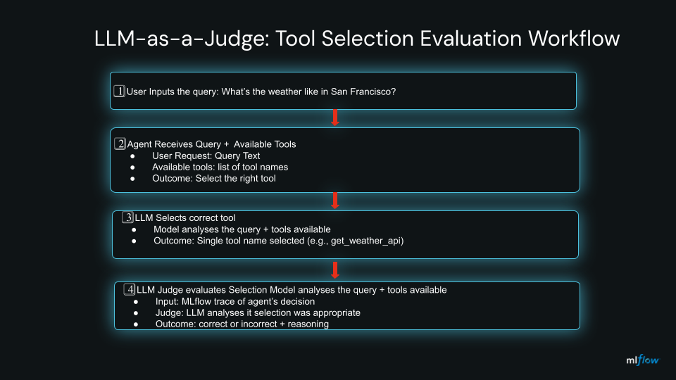

# LLM-as-a-Judge Tutorial Tool Selection Evaluation with MLflow

A hands-on tutorial demonstrating how to use MLflow's LLM-as-a-Judge pattern to evaluate AI agent decisions.

## What You'll Learn

This tutorial teaches you how to:

1. **Trace agent actions** with MLflow's `@mlflow.trace()` decorator
2. **Create a judge** using `mlflow.genai.judges.make_judge()`
3. **Evaluate agent decisions** using the judge
4. **Integrate with MLflow experiments** for reproducibility

## Tutorial Scenario

**Problem**: An AI agent selects a tool to answer user queries. How do we evaluate if it chose the right tool?

**Solution**: Use an LLM-as-a-Judge to automatically evaluate the agent's tool selection based on predefined criteria.

**Evaluation Criteria**:
- Does the selected tool match the user's intent?
- Can this tool address the task requirements?
- Are there more suitable tools available?

### Visual Workflow

See [workflow diagrams](docs/workflow-diagram.md) for visual representations of:
- Notebook cell execution flow
- Python script execution flow
- LLM-as-a-Judge pattern sequence diagram
- Side-by-side format comparison

## Architecture: How LLM Selects Tools

The agent uses LLM prompting to select the most appropriate tool for a given user query. The judge then evaluates this selection using LLM-as-a-Judge pattern.

### Agent Selection Process




### Key Implementation Details

The selection flow is implemented in [tool_selection_judge.py](tool_selection_judge.py):

```python
# Agent selects tool using LLM
@mlflow.trace(span_type=SpanType.AGENT, name="select_tool")
def select_tool(self, user_request: str, available_tools: List[str]) -> str:
    # Get prompt with selection criteria
    prompt = get_tool_selection_prompt(user_request, available_tools)

    # LLM selects the most appropriate tool
    response = self.client.chat.completions.create(
        model=self.config.model,
        messages=[{"role": "user", "content": prompt}],
        max_tokens=50
    )

    tool_selected = response.choices[0].message.content.strip()
    return tool_selected  # e.g., "get_weather_api"
```

**Important**: The agent doesn't use function calling here. Instead:
- **Prompt-based selection**: LLM reads the query and available tools, then outputs a tool name
- **Judge evaluates**: A separate LLM (the judge) assesses whether the selection was correct
- **Traced decision**: MLflow captures the entire decision for evaluation

### Judge Evaluation Process

```python
# Judge is created using make_judge()
self.judge = make_judge(
    name="tool_selection_quality",
    instructions=get_judge_instructions(),  # Evaluation criteria
    feedback_value_type=Literal["correct", "incorrect"],
    model=judge_model
)

# Judge evaluates the agent's decision
def evaluate(self, trace_id: str) -> Dict[str, Any]:
    trace = mlflow.get_trace(trace_id)  # Get agent's decision trace
    feedback = self.judge(trace=trace)   # Judge evaluates

    return {
        "is_correct": feedback.value == "correct",
        "reasoning": feedback.rationale
    }
```

**Key Differences from Agent Planning**:
- **Agent Planning**: LLM uses function calling to dynamically select tools and execute them
- **Tool Selection**: LLM outputs a tool name; judge evaluates if the choice was correct
- **No Execution**: This tutorial focuses on evaluation, not tool execution

## Files

- `tool_selection_judge.py` - Complete tutorial implementation with step-by-step comments
- `tool_selection_judge.ipynb` - Interactive Jupyter notebook version of the tutorial
- `prompts.py` - All prompts (agent + judge instructions) - easy to customize
- `__init__.py` - Package exports

## Running the Tutorial

### Option A: Python CLI Script

```bash
# Run with default settings (Databricks)
uv run mlflow-tool-selection-judge

# Run with OpenAI
uv run mlflow-tool-selection-judge --provider openai --model gpt-4o-mini

# Try your own query
uv run mlflow-tool-selection-judge --query "Send email to John about the meeting"

# Use a different model for the judge
uv run mlflow-tool-selection-judge --judge-model databricks-claude-sonnet-4-5

# Customize the experiment name
uv run mlflow-tool-selection-judge --mlflow-experiment my-tutorial

# Combine multiple options
uv run mlflow-tool-selection-judge \
  --provider openai \
  --query "What's the current stock price?" \
  --judge-model gpt-4o

# View results in MLflow UI
mlflow ui
```

**CLI Output Example:**
```
======================================================================
TUTORIAL: LLM-as-a-Judge for AI Agent Tool Selection
======================================================================

[Step 1] Setting up MLflow tracking
  └─ Experiment: tool-selection-judge
  └─ View traces: mlflow ui

[Step 2] Initializing Judge
  └─ Provider: databricks
  └─ Agent Model: databricks-gpt-5
  └─ Judge Model: databricks-gemini-2-5-flash

[Step 3] Testing Scenario
  └─ Query: What's the weather like in San Francisco?
  └─ Available Tools: ['get_weather_api', 'search_web', 'get_calendar', 'send_email']

[Step 4] Agent selects tool...
  └─ ✓ Tool selected: get_weather_api

[Step 5] Judge evaluates the selection...
  └─ Evaluation: CORRECT
  └─ Reasoning: The agent correctly selected 'get_weather_api' as it directly addresses the weather query...

======================================================================
```

**Environment Setup:**

**For Databricks:**
```bash
export DATABRICKS_TOKEN='your-token'
export DATABRICKS_HOST='https://your-workspace.cloud.databricks.com'
```

**For OpenAI:**
```bash
export OPENAI_API_KEY='sk-...'
```

### Option B: Interactive Jupyter Notebook

The notebook provides step-by-step execution with detailed explanations:

**1. Setup and Configuration**
```python
# Cell 1-3: Environment setup
# - Load .env file for credentials
# - Configure provider (Databricks/OpenAI)
# - Set models for agent and judge
```

**2. Initialize MLflow and Judge**
```python
# Cell 5: Setup MLflow tracing
[Step 1] MLflow tracing enabled
  └─ Experiment: tool-selection-notebook
  └─ View traces: mlflow ui

# Cell 7: Import AgentToolSelectionJudge
✓ AgentToolSelectionJudge imported successfully

# Cell 9: Initialize judge
[Step 2] Initializing Judge
  └─ Provider: databricks
  └─ Agent Model: databricks-gpt-5
  └─ Judge Model: databricks-gemini-2-5-flash
```

**3. Run Single Example**
```python
# Cell 11: Define scenario
[Step 3] Testing Scenario
  └─ Query: What's the weather like in San Francisco?
  └─ Tools: ['get_weather_api', 'search_web', 'get_calendar', 'send_email']

# Cell 13: Agent selects tool
[Step 4] Agent selects tool...
  └─ ✓ Tool selected: get_weather_api

# Cell 15: Judge evaluates
[Step 5] Judge evaluates the selection...
======================================================================
Evaluation: CORRECT

Reasoning:
The agent correctly selected 'get_weather_api' as it directly
addresses the user's weather query for San Francisco...
======================================================================
```

**4. Batch Testing with Multiple Scenarios**
```python
# Cell 17: Run batch test with 4 scenarios
[Step 6] Running batch test...
======================================================================

Scenario 1/4: Weather query
  Query: What's the weather?
  Selected: get_weather_api
  ✓ CORRECT

Scenario 2/4: Email task
  Query: Send email to John
  Selected: send_email
  ✓ CORRECT

Scenario 3/4: Calendar query
  Query: What's on my schedule?
  Selected: get_calendar
  ✓ CORRECT

Scenario 4/4: Web search
  Query: Latest news about AI
  Selected: search_web
  ✓ CORRECT

Results: 4/4 correct (100.0%)
======================================================================
```

**5. Customization Examples**
```python
# Cell 19: View and modify prompts
# - See agent selection prompt
# - See judge evaluation criteria
# - Try modifying prompts and re-running examples
```

**Notebook Setup:**

**1. Install dependencies:**
```bash
pip install python-dotenv  # Optional but recommended
```

**2. Set up credentials:**

Create a `.env` file in the `genai/agents/tools_selection/` directory:

**For Databricks:**
```
DATABRICKS_TOKEN=your-token-here
DATABRICKS_HOST=https://your-workspace.cloud.databricks.com
```

**For OpenAI:**
```
OPENAI_API_KEY=sk-your-key-here
```

**3. Launch the notebook:**
```bash
jupyter notebook tool_selection_judge.ipynb
```

**Notebook Advantages:**
- ✅ Step-by-step execution with immediate feedback
- ✅ Easy to experiment with different queries
- ✅ View intermediate results (tool selection, evaluation)
- ✅ Modify and re-run individual steps
- ✅ Built-in batch testing with multiple scenarios
- ✅ Educational comments and explanations

## Tutorial Walkthrough

### Step-by-Step Code Example

```python
import mlflow
from genai.common.config import AgentConfig
from genai.agents.tools_selection import AgentToolSelectionJudge

# Step 1: Configure the agent
config = AgentConfig(
    model="databricks-gpt-5",
    provider="databricks",
    temperature=0.0
)

# Step 2: Initialize the judge (creates MLflow judge internally)
judge = AgentToolSelectionJudge(
    config=config,
    judge_model="databricks-gemini-2-5-flash"  # Optional: use different model for judging
)

# Step 3: Define your scenario
user_request = "What's the weather like in San Francisco?"
available_tools = ["get_weather_api", "search_web", "get_calendar", "send_email"]

# Step 4: Agent performs action (automatically traced by MLflow)
tool_selected = judge.select_tool(user_request, available_tools)
print(f"Agent selected: {tool_selected}")

# Step 5: Judge evaluates the agent's decision
trace_id = mlflow.get_last_active_trace_id()
result = judge.evaluate(trace_id)

# Step 6: Review the evaluation
print(f"Correct: {result['is_correct']}")
print(f"Reasoning: {result['reasoning']}")
```

### What Happens Under the Hood

1. **Tracing**: The `@mlflow.trace()` decorator captures:
   - Input parameters (user request, available tools)
   - Agent's decision (selected tool)
   - Execution metadata

2. **Judge Creation**: `make_judge()` creates a specialized evaluator:
   - Uses evaluation instructions from `prompts.py`
   - Defines feedback format (correct/incorrect)
   - Configures the judge model

3. **Evaluation**: The judge analyzes the trace:
   - Reviews the agent's input and output
   - Applies evaluation criteria
   - Returns structured feedback (value + rationale)

## Configuration Options

### Agent Configuration

| Parameter | Description | Default |
|-----------|-------------|---------|
| `provider` | LLM provider ("openai" or "databricks") | "databricks" |
| `model` | Model for agent | "databricks-gpt-5" / "gpt-4o-mini" |
| `temperature` | Sampling temperature (0.0-2.0) | 1.0 |
| `judge_model` | Model for judge (optional) | Same as agent model |

### Environment Variables

**Databricks:**
```bash
export DATABRICKS_TOKEN='your-token'
export DATABRICKS_HOST='https://your-workspace.cloud.databricks.com'
```

**OpenAI:**
```bash
export OPENAI_API_KEY='sk-...'
```

## Evaluation Output

The judge returns structured feedback:

```python
{
    "is_correct": bool,   # True if tool selection was appropriate
    "reasoning": str      # Detailed explanation from the judge
}
```

## Key Concepts

### MLflow Tracing
The `@mlflow.trace()` decorator automatically captures:
- Function inputs and outputs
- Execution time and metadata
- Nested function calls (parent-child relationships)

### MLflow Judge
Created with `make_judge()`:
- Takes predefined evaluation criteria (instructions)
- Uses an LLM to assess traces
- Returns structured feedback (value + rationale)

### Separation of Concerns
- **Agent**: Performs the task (tool selection)
- **Judge**: Evaluates the agent's performance
- **Prompts**: Define evaluation criteria (easy to modify)

## Customization

All prompts are centralized in [prompts.py](prompts.py) for easy customization.

### Modify Agent Behavior

Change how the agent selects tools:

```python
def get_tool_selection_prompt(user_request: str, available_tools: list) -> str:
    return f"""Your custom tool selection instructions here...

User Request: {user_request}
Available Tools: {available_tools}

Select the best tool and explain why."""
```

### Modify Evaluation Criteria

Change how the judge evaluates:

```python
def get_judge_instructions() -> str:
    return """Your custom evaluation instructions here...

{{ trace }}

Your evaluation criteria here..."""
```

**Important**: Judge instructions must include at least one template variable:
- `{{ trace }}` - The full MLflow trace (recommended)
- `{{ inputs }}` - Just the input parameters
- `{{ outputs }}` - Just the output values
- `{{ expectations }}` - Expected behavior (if defined)

### Add More Test Scenarios

Edit the `main()` function in [tool_selection_judge.py](tool_selection_judge.py):

```python
# Add your own test cases
scenarios = [
    ("What's the weather?", ["get_weather_api", "search_web"]),
    ("Send email to John", ["send_email", "get_calendar"]),
    # ... more scenarios
]
```

## Tutorial Formats Comparison

### Quick Visual Comparison

```
┌─────────────────────────────────────────────────────────────────────┐
│  📓 Jupyter Notebook          🐍 Python Script                      │
│  (tool_selection_judge.ipynb) (tool_selection_judge.py)             │
├─────────────────────────────────────────────────────────────────────┤
│                                                                     │
│  1. Load .env file ✓          1. Export env vars                    │
│  2. Configure provider         2. Run: uv run mlflow-...            │
│  3. Initialize judge           3. Single execution →                │
│  4. Run example                4. View result                       │
│  5. Try more examples ✓                                             │
│  6. Batch test (4 scenarios) ✓                                      │
│  7. View prompts ✓                                                  │
│                                                                     │
│  ✅ Interactive learning       ✅ Automation ready                  │
│  ✅ Multiple examples          ✅ CI/CD integration                 │
│  ✅ Easy experimentation       ✅ Scriptable                        │
└─────────────────────────────────────────────────────────────────────┘
```

### Detailed Comparison

| Feature | Jupyter Notebook | Python Script |
|---------|------------------|---------------|
| **Best For** | Learning & experimentation | Production & automation |
| **Interactivity** | ✅ Run cells individually | ❌ Single execution |
| **Credentials** | `.env` file (auto-loaded) | Environment variables |
| **Examples** | Multiple interactive examples | Single query via CLI |
| **Explanations** | Rich markdown with inline docs | Code comments |
| **Batch Testing** | ✅ Built-in test scenarios | ❌ Manual scripting |
| **Customization** | ✅ Easy to modify and re-run | Requires code edits |

**Recommendation**: Start with the Jupyter notebook to understand the concepts, then use the Python script for automation.

## Next Steps

After completing this tutorial:
1. **Explore MLflow UI**: Run `mlflow ui` to see detailed traces
2. **Modify Prompts**: Edit `prompts.py` to change evaluation criteria
3. **Try Different Models**: Experiment with different agent and judge models
4. **Add More Tools**: Expand the `available_tools` list
5. **Batch Evaluation**: Use the notebook's test scenarios feature
6. **Apply to Your Use Case**: Adapt this pattern for your own agent evaluations

## References

- [MLflow GenAI Judges Documentation](https://mlflow.org/docs/latest/llms/llm-evaluate/index.html)
- [Original Tutorial](https://medium.com/@juanc.olamendy/using-llm-as-a-judge-to-evaluate-agent-outputs-a-comprehensive-tutorial-00b6f1f356cc)
- [Jupyter Notebook](tool_selection_judge.ipynb) - Interactive tutorial in this repository
