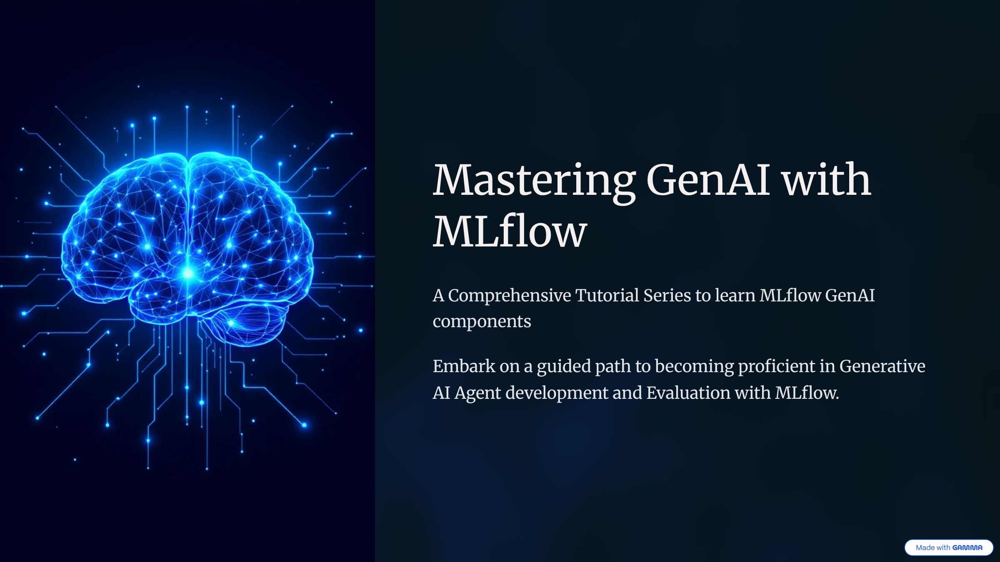

# MLflow GenAI Tutorial Series



## Tutorial 1: Getting Started with GenAI and MLflow

This tutorial series teaches you how to use MLflow's open source platform for building, tracking, tracing, prompt registry and optimizaiton, evaluating, and debugging GenAI applications.

### 📚 Tutorial Structure

#### Notebook 1.1: Setup and Introduction (15-20 min)
- Understanding MLflow for GenAI
- Installation and configuration
- First tracked run
- MLflow UI basics

#### Notebook 1.2: Experiment Tracking for LLMs (25-30 min)
- Tracking LLM parameters and metrics
- Comparing model configurations
- Cost tracking and optimization
- Organizing experiments with tags
- Parent-child runs for workflows

#### Notebook 1.3: Introduction to Tracing (30-35 min)
- Auto-tracing with MLflow
- Understanding the trace model
- Manual instrumentation 
- Viewing traces in UI

#### Notebook 1.4: Manual Tracing and Advanced Observability (30-35 min)
- Custom span decorators
- Tracing complex workflows
- Debugging with traces
- Multi-step agentic patterns

#### Notebook 1.5: Prompt Management (15-20 min)
- Creating prompt templates
- Versioning prompts
- Registering in the Prompt Registry
- Searching Prompt Registry
- Using prompts from the Prompt Registry
- Linking prompts to experiments

#### Notebook 1.6: Framework Integrations (15-20 min)
- OpenAI direct API integration
- LangChain chains and workflows
- LlamaIndex document indexing and RAG
- Framework comparison matrix
- Best practices for each framework

#### Notebook 1.7: Evaluating Agents (25-30 min)
- LLM-as-Judge evaluation patterns
- MLflow built-in scorers (RelevanceToQuery, Correctness, Guidelines)
- Custom scorers with @scorer decorator
- DeepEval integration for conversations
- Session-level multi-turn evaluation

#### Notebook 1.8: Prompt Optimization with GEPA (10-15 min)
- Automatic prompt optimization with GEPA algorithm
- MLflow Prompt Registry integration
- Before/after evaluation comparison

#### Notebook 1.9: Complete RAG Application (25-30 min)
- Building a full RAG pipeline
- End-to-end tracing
- Performance analysis
- RAG evaluation with RAGAS metrics

## 🎓 Learning Outcomes

After completing this tutorial, you will be able to:

### Core Skills
- ✅ Set up MLflow for GenAI development
- ✅ Track LLM experiments systematically
- ✅ Implement comprehensive tracing
- ✅ Debug GenAI applications effectively
- ✅ Manage prompts with version control
- ✅ Build RAG systems

### Advanced Capabilities
- ✅ Cost tracking and optimization
- ✅ Performance analysis and debugging
- ✅ Multi-framework integration
- ✅ Hierarchical trace creation
- ✅ Custom span instrumentation
- ✅ Agent workflow tracing


### 🚀 Getting Started

This project uses [UV](https://docs.astral.sh/uv/) for dependency management.

1. **Install UV** (if not already installed)
```bash
curl -LsSf https://astral.sh/uv/install.sh | sh
```

2. **Install Dependencies**
```bash
uv sync
```

3. **Configure API Keys**
Create a `.env` file in the tutorials directory:
```
OPENAI_API_KEY=your-api-key-here
MLFLOW_TRACKING_URI=http://localhost:5000
```

4. **Start Jupyter**
```bash
uv run jupyter notebook
```

5. **Start MLflow UI** (in a separate terminal)
```bash
uv run mlflow ui --port 5000
```

6. **Open Browser**
Navigate to http://localhost:5000

### 📋 Prerequisites

- Python 3.10+
- [UV](https://docs.astral.sh/uv/) package manager
- OpenAI API key (or Databricks Workspace)
- Basic understanding of Python and LLMs

### 🎯 Learning Objectives

By the end of all tutorials, you will:

- ✅ Understand MLflow's core GenAI components
- ✅ Track and trace LLM experiments systematically
- ✅ Implement comprehensive tracing for observability
- ✅ Debug GenAI applications using trace visualizations and MLflow Assistant
- ✅ Manage prompts with version control and Prompt Registery
- ✅ Evaluate an agent using MLflow predefined judges, custom and integrated judges from DeepEval and RAGAS
- ✅ Build end-to-end RAG applications
- ✅ Build and evaluate multi-agent orchestration systems

### 📂 Directory Structure

```
mlflow-genai-tutorial-1/
├── 01_setup_and_introduction.ipynb
├── 02_experiment_tracking.ipynb
├── 03_introduction_to_tracing.ipynb     
├── 04_manual_tracing_advanced.ipynb     
├── 05_prompt_management.ipynb           
├── 06_framework_integrations.ipynb      
├── 07_evaluating_agents.ipynb
├── 08_prompt_optimization.ipynb
├── 09_complete_rag_application.ipynb
├── .env                                 (create this yourself and use the template env_template)
└── README.md
```

### 🔗 Resources

- [MLflow Documentation](https://mlflow.org/docs/latest/)
- [MLflow GenAI Guide](https://mlflow.org/docs/latest/genai/)
- [MLflow GitHub](https://github.com/mlflow/mlflow)
- [MLflow Community](https://mlflow.org/community/)

### 💡 Tips

- Keep the MLflow UI open while working through notebooks
- Experiment with different parameter values
- Compare runs in the UI to understand trade-offs
- Tag runs for easy organization
- Track costs from the beginning

### ❓ Troubleshooting

**Issue**: MLflow UI won't start
```bash
# Try a different port
uv run mlflow ui --port 5001
```

**Issue**: API key not recognized
```python
# Restart Jupyter kernel after adding to .env
# Or set manually:
import os
os.environ["OPENAI_API_KEY"] = "your-key"
```

**Issue**: Module not found
```bash
# Sync dependencies with UV
uv sync

# Or install specific package
uv add mlflow openai python-dotenv
```

### 📝 License

This tutorial series is provided as educational content for learning MLflow's GenAI capabilities.

---

## 📝 Feedback & Contributions

- Found an issue? Open a GitHub issue
- Have suggestions? Submit a pull request
- Want to share? Tag us on social media
- Questions? Check the MLflow community

---

**Authors**: Jules (Databricks Developer Relations) + Claude Code
**Date**: January 2025
**MLflow Version**: 3.9.0+
